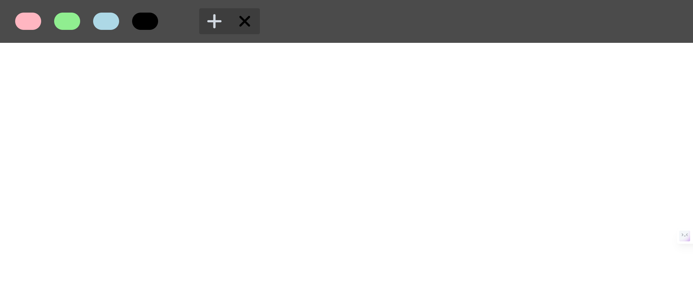
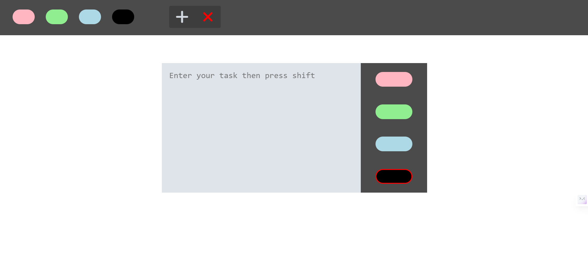
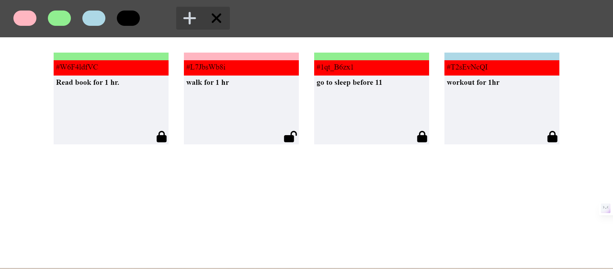

# TicketTracker
---
TicketTrackr is a task scheduling and ticket management application built using vanilla JavaScript, HTML, and CSS. It provides users with the ability to create, edit, prioritize, and delete tasks represented as colored tickets. Users can easily categorize tasks using different colors and utilize advanced filtering to find tasks based on their color.

## Demo
---
 ### Home Page :
 
 
 ### Create Task :
 
 
 ### Edit Task :


## Features
---
- Create tasks with colored tickets.
- Edit existing tasks and update their priority by changing the color of the ticket.
- Delete tasks that are no longer needed.
- Advanced filtering options to find tasks based on their color.

## Getting Started
---
To run the TicketTrackr app locally, follow these steps:

1. Clone the repository:
   ```bash
   git clone https://github.com/your-username/TicketTrackr.git
   cd TicketTrackr

    ```
2. Open the `index.html` file in your browser.
3. Use Live Server to run the app locally.


## Contributing
 ---
Contributions are always welcome! If you have any suggestions, please create a pull request. Feel free to fork this repo.


